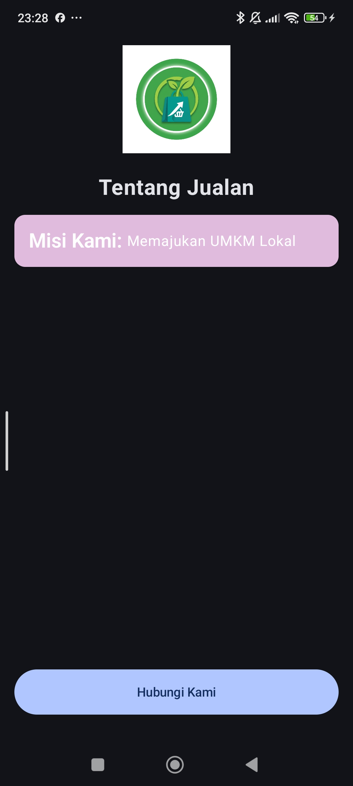
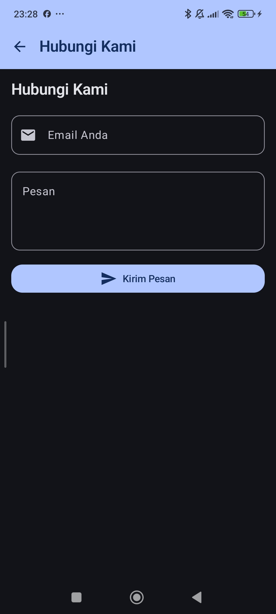
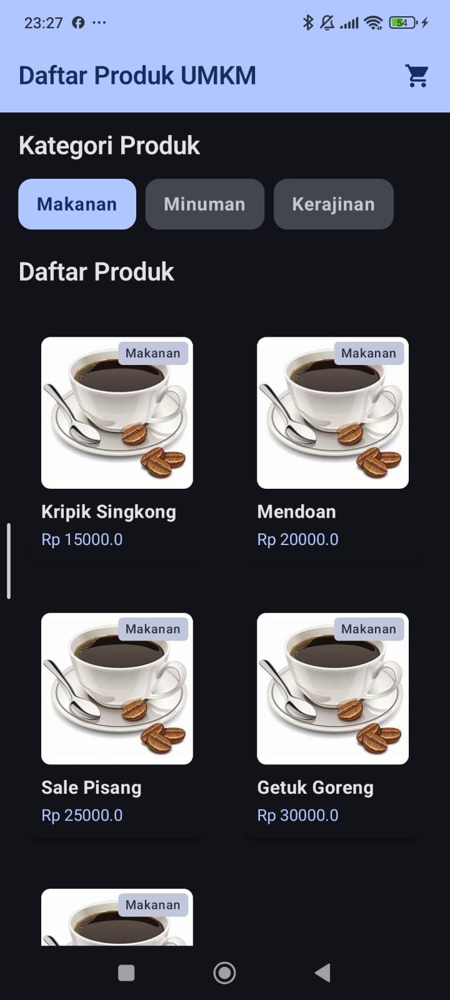

Laporan Praktikum Pemrograman Mobile
Nama        : Yusuf Rafii Ahmad
NIM         : H1D024049
Shift       : Awal I / Akhir C  
Praktikum   : Pemrograman Mobile
---
📝 Tugas Pertemuan 1
Tanggal: Selasa, 1 September 2026

Kesimpulan Praktikum:  
Pada pertemuan pertama, praktikum memberikan pemahaman dasar tentang Kotlin dan Jetpack Compose serta struktur project Android. Mahasiswa juga belajar membuat layout dasar menggunakan Column, Row, dan Box serta memahami konsep @Composable dan @Preview.
---
📝 Tugas Pertemuan 2
Tanggal: Selasa, 8 September 2026

Kesimpulan Praktikum:  
Pada pertemuan kedua, praktikum mempelajari penerapan Material Design 3 pada aplikasi Android menggunakan Jetpack Compose. Mahasiswa belajar menggunakan komponen seperti Scaffold, TopAppBar, TextField, Button, dan komponen interaktif lainnya untuk membangun tampilan yang lebih terstruktur.
---
**📝 Tugas Pertemuan 3
Tanggal: Selasa, 15 September 2026

Kesimpulan Praktikum:  
Pada pertemuan ketiga, praktikum mempelajari pengelolaan data dalam bentuk list menggunakan data class dan dummy data. Mahasiswa juga menerapkan LazyRow dan LazyVerticalGrid untuk menampilkan daftar kategori dan produk secara efisien.**
